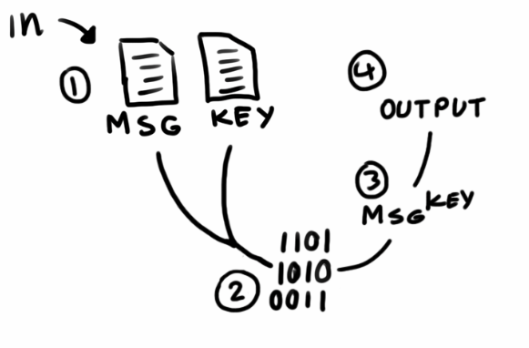

# Java Crypt

Java Crypt kan kryptera eller dekryptera ett textmeddelande sparat i en fil med hjälp av en nyckel, också sparad i en fil.

## Innehållsförteckning
1. [Syfte](#Syfte)
2. [Koden](#Koden)
3. [X-OR-CAST](#X-OR-CAST)
4. [För att köra](#För)


## Syfte
Skapa ett program som kan kryptera och dekryptera en fil med hjälp av en nyckel.

## Koden



1. Ladda in meddelandet och nyckeln, se till att nyckeln är lika lång eller längre än meddelandet.
2. Konvertera begge till byte arrays.
3. x-or-casta nyckeln över meddelandet och skapa 
produkten
4. Skriv produkten till output

### X-OR-CAST

Metoden encryt() tar in meddelandet och nyckeln. Efter den koverterat om dem till byte arrays loopas dem igenom och för varje byte körs en x-or-cast med meddelandet och nyckeln. 
```java
(byte) (message[i] ^ key[i]);
````

## För att köra
Gå till [Releases](https://github.com/Yogsther/javaCrypt/releases) och 
ladda ned den senaste .JAR filen, eller bygg ```Crypt.java``` som finns i ```/src```

### Kör (JAR)
```
$ java -jar Crypt.jar message_dir key_dir [output_dir]
```

### Kör (Class)
```
$ java Crypt message_dir key_dir [output_dir]
```

Standard output är ```output.txt```


